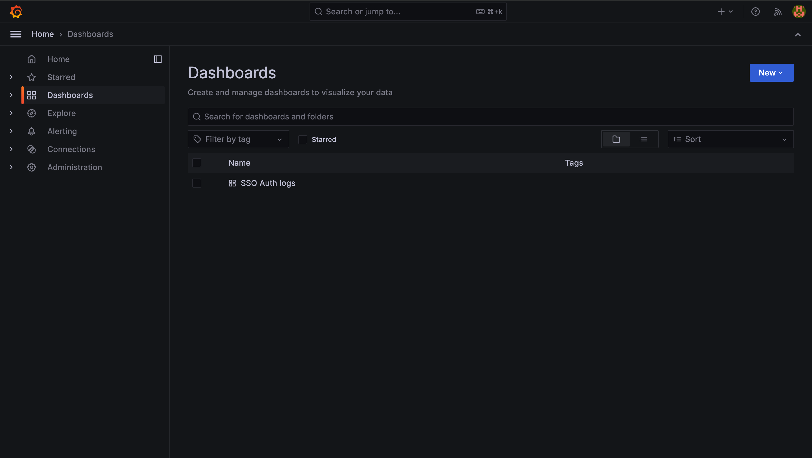
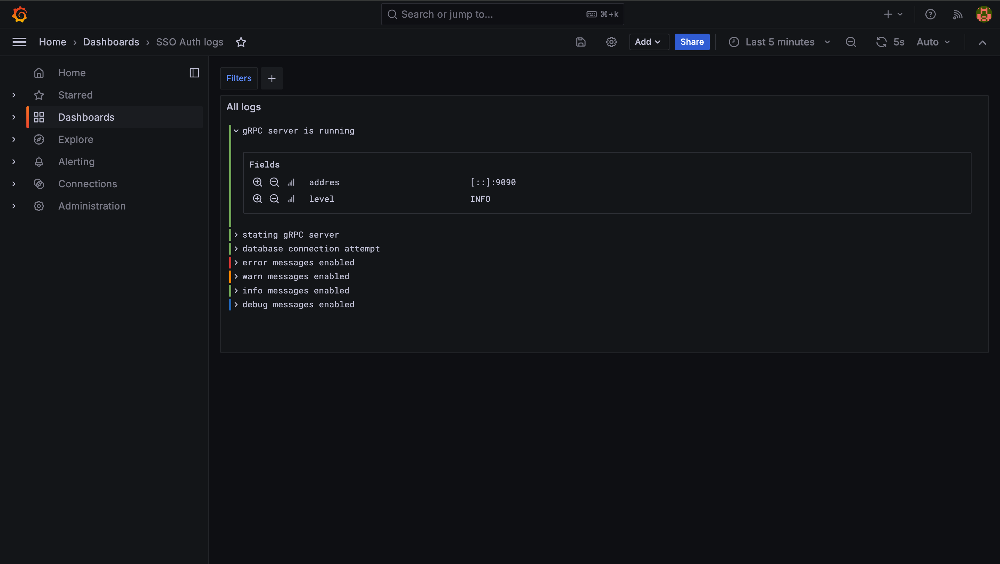
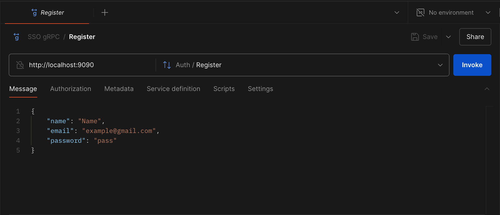
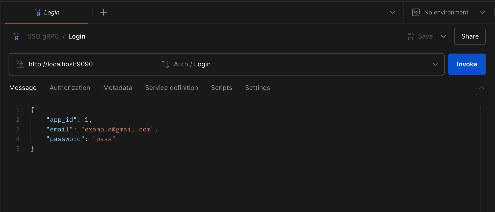
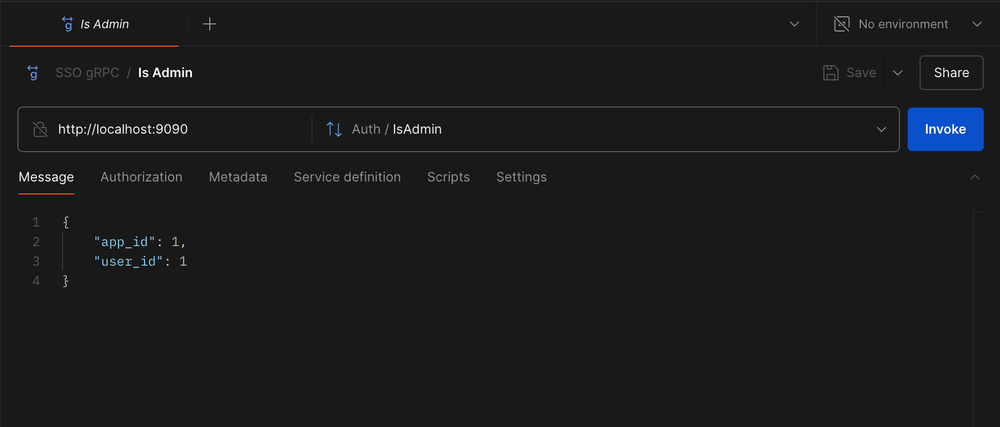
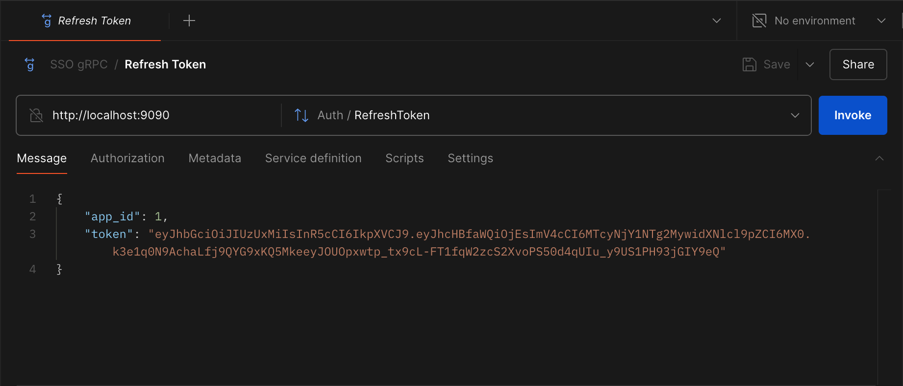

# SSO AUTH gRPC server

## Contents

- [About](#about-project)
- [Customization](#customization)
- [Installation](#installation)
- [Protocol Buffers](#protocol-buffers)
- [Grafana](#grafana)
- [Usage](#usage)

## About project

SSO AUTH is an authorization microservice based on the gRPC protocol that performs several simple functions:
- Registration
- Login
- Verify if the user is an administrator
- Update token pairs
- Retrieve user information by token

## Customization

If you want to make changes to the startup configuration, you can modify the config file located in config/local.yaml, or you can create your own config file. If you add your own config file, change the CONFIG_PATH field in the .env file.

### Config file

```yaml
env: local # Application startup mode, depending on the selection, will differ the level and appearance of logs
migrations_path: ./migrations # Path to the folder where migrations to the database are located (it is not desirable to change it)
token_expires: 1h # User token lifetime 
refresh_token_expires: 168h # Lifetime of the refresh token 

database: # Database connection
  host: localhost # Database host
  port: 5432 # Database port
  user: postgres # Database user
  password: postgres-user # Database password
  name: SSO # Name of database sever
  sslmode: disable # Database SSL mode
  attemps: 5 # Number of attempts to connect to the database 
  delay: 5s # Interval between attempts to connect to the database
  timeout: 5s # Abort after a failed attempt to connect to the database

grpc: # gRPC Server configuration
  port: 9090 # gRPC port
  timeout: 5s # Read and Write timeout
```

### .env file

- CONFIG_PATH - Path to the config file

## Installation

- [Local Installation](#local-installation)
- [Docker](#docker)

### Local installation
To migrate to the database, run the following command from the root of the project:

```bash
go run cmd/migrations/main.go --action=up
```

To start the application, you need to run the following commands in the root of the project:

```bash
go build -o build/main cmd/sso/main.go
```
```bash
./build/main
```
Or run without creating a binary
```bash
go run cmd/sso/main.go
```

### Docker
> IMPORTANT If you have made changes to the configuration files, check them against the parameters specified in docker-compose.yml

To start a project using Docker, run the following command from the root of the project:
```bash
docker-compose up -d
```
To stop, use:
```bash
docker-compose down
```
## Protocol Buffers

The proto file and the Go language files generated from it are used to configure the gRPC server. The proto file and the generated files are located in the [bordviz/sso-protos](https://github.com/bordviz/sso-protos) repository.

## Grafana

If you are running a project using Docker and the env mode is `dev` or `prod`, you can monitor logs using the Grafana Loki service. To access the service, go to `http://localhost:4000`, enter `root` as login and `sso-root` as password. In the menu, open the Dashboards tab and select the added `SSO Auth logs` dashboard. 

#### Dashboards


#### Logs


## Usage
- [Register](#register)
- [Login](#login)
- [Is Admin](#is-admin)
- [Refresh token](#refresh-token)
- [Current user](#current-user)

#### Register


#### Login


#### Is Admin


#### Refresh token


#### Current user


### ⭐️ If you like my project, don't spare your stars 🙃